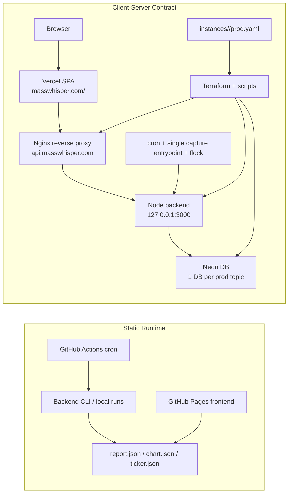

# Client-Server Transition

This document freezes the client/server design and its relation to the static runtime.

Its goal is to make the two deployment designs and their relationship easy to explain and defend.

## Diagram

## Static Runtime

- frontend is a static site published on GitHub Pages
- backend runs through GitHub Actions or local CLI entrypoints
- data is produced as static JSON artifacts
- frontend reads `report.json`, `chart.json`, and `ticker.json`
- scheduling is handled by GitHub Actions cron
- secrets are carried by GitHub Secrets and local `.env`

## Client-Server Contract

- frontend is public on `masswhisper.com/<topic-slug>`
- frontend is deployed on Vercel as a SPA
- frontend routing is path-based and falls back to `index.html`
- frontend reads `topic-slug` from the URL path
- read-only API is public on `api.masswhisper.com/api/v1/topics/<topic-slug>/...`
- a reverse proxy on the backend VM exposes the API publicly
- the Node backend is not exposed directly and listens only locally behind the proxy
- capture is triggered locally through `cron`, a single capture entrypoint, and `flock`
- each production topic has its own Neon database
- instance configuration is defined by an immutable manifest at `instances/<topic-slug>/prod.yaml`

## Deployment Modes

### Shared Platform

- a shared platform serves multiple topics through:
  - `masswhisper.com/<topic-slug>`
  - `api.masswhisper.com/api/v1/topics/<topic-slug>/...`
- runtime status is exposed through `GET /api/v1/topics/<topic-slug>/status`
- topics are application-level data, not infrastructure resources

### Dedicated Deployment

- a dedicated deployment provisions one backend runtime on one VM
- one topic is injected through the manifest
- the minimal runtime status endpoint is exposed as `GET /status`
- the public frontend is exposed on `<domain>`
- the public API is exposed on `api.<domain>`
- the dedicated frontend is wired to the dedicated backend
- this mode is the infrastructure proof and the isolated deployment story

## What Changes

- runtime moves from static JSON publishing to frontend + API
- frontend stops treating generated JSON files as the runtime source of truth
- backend becomes the read-side source of truth
- deployment becomes instance-shaped through a manifest and backend infra conventions
- scheduling moves from GitHub Actions cron to local cron on the backend runtime

## What Stays Intentionally Simple

- only one real topic is deployed end to end in the dedicated deployment path
- only `prod` is deployed in Dedicated Deployment
- multi-topic is proven mainly by the model, naming conventions, manifest shape, and Terraform structure
- Shared Platform is opened after Dedicated Deployment is closed end to end
- API stays read-only
- no public write or admin endpoints
- frontend implementation stays fixed
- frontend hosting stays fixed on Vercel
- database provider stays fixed on Neon
- LLM provider and model choice stay fixed
- no multi-VM backend stack
- no dedicated worker split yet

## Frozen Conventions

### Routing

- public frontend route: `masswhisper.com/<topic-slug>`
- public API prefix: `api.masswhisper.com/api/v1/topics/<topic-slug>`
- frontend route expresses the product entrypoint
- API route expresses the data contract

### Naming

- `topic_slug` must be URL-safe and stable
- `environment` is modeled as `dev|prod`
- only `prod` is deployed in the dedicated deployment path
- `frontend_path` and `backend_api_prefix` belong to routing contracts, not to infrastructure naming
- infrastructure naming derives from a stable deployment identity
- Terraform derives that deployment identity locally from stable inputs
- those inputs are `domain`, `topic_slug`, and `environment`
- the manifest does not carry a separate infrastructure identifier at this stage
- in Dedicated Deployment, the derived identity can track the topic
- in Shared Platform, the derived identity must stay platform-level

### Runtime

- Vercel hosts the frontend
- Nginx is the target reverse proxy for the backend VM
- Node listens locally behind the proxy
- TLS is terminated at the proxy
- CORS is driven by an origin allowlist injected through environment variables

## Demo Topic

The initial real deployed topic is:

- `fr-dev-job-market`

Its role is to prove:

- one real topic deployed end to end
- one real immutable manifest
- one real backend runtime shape
- one real read-side contract consumed by the frontend

## Instance Contract

The immutable instance manifest lives at:

- `instances/<topic-slug>/prod.yaml`

Minimum expected fields:

- `topic_slug`
- `topic_name`
- `environment`
- `schedule`
- `sources_variant`
- `prompt_variant`
- `database_name`
- `domain`

Rules:

- the manifest is the single source of truth for an instance
- scripts may read and validate the manifest
- scripts must not mutate the manifest
- Terraform consumes generated input derived from the manifest, not the raw YAML directly
- `sources_variant` is a versioned bundle identifier
- `sources_variant` must follow `<topic-slug>-vN`
- the private sources bundle filename must be `<sources_variant>.json`
- the private sources bundle JSON must declare `"variant": "<sources_variant>"`
- `prompt_variant` is a versioned bundle identifier
- `prompt_variant` must follow `<topic-slug>-vN`
- the private prompt bundle filename must be `<prompt_variant>.json`
- the private prompt bundle JSON must declare `"variant": "<prompt_variant>"`

## Reserved Slugs

The following slugs must not be allocated to topics:

- `about`
- `contact`
- `legal`
- `privacy-policy`
- `cookie-policy`
- `blog`
- `articles`
- `services`
- `products`
- `case-studies`
- `faq`
- `reviews`
