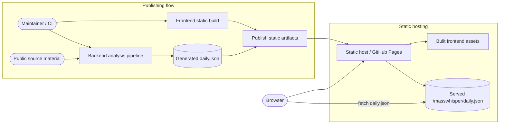
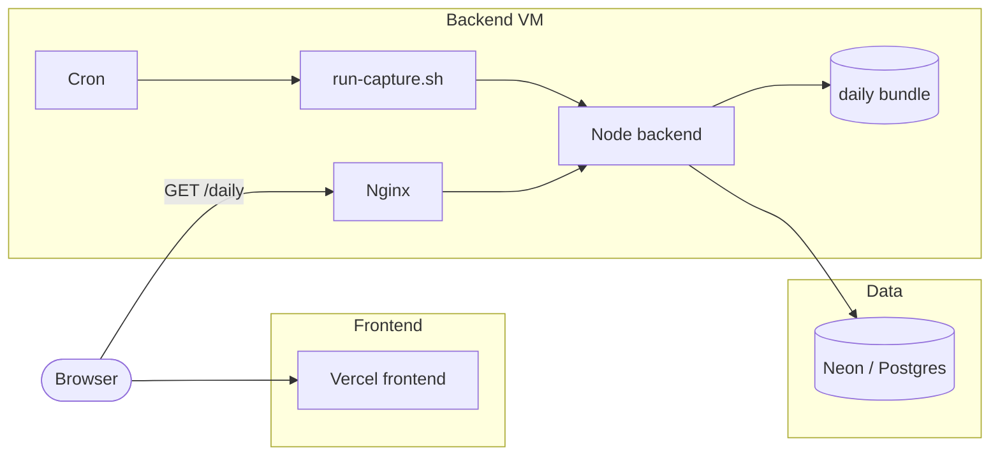
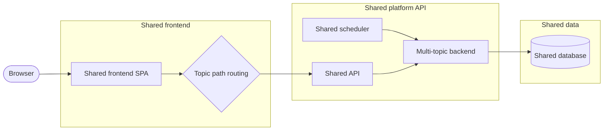

# Deployment Architecture

This document defines the deployment architectures supported by MassWhisper and their current status.

Its purpose is to make the relationship between deployment models explicit.

## Model Status

- `static` → supported legacy deployment model
- `dedicated` → current client-server deployment model
- `shared` → planned deployment model, not implemented yet

## Static

The static model publishes generated frontend assets and a generated daily bundle.

Architecture:

- frontend is served as a static site
- backend execution happens before publication
- browser reads `daily.json` from the frontend origin
- scheduling is handled outside the public runtime
- public reads do not require a backend API

This model stays simple to publish and simple to serve.

### Diagram

## Dedicated

The dedicated model deploys one frontend and one backend runtime for one topic.

Architecture:

- frontend is hosted on its public domain
- API is exposed on its public API domain
- `Nginx` is the public HTTP boundary on the backend VM
- the Node backend listens only on a local interface behind `Nginx`
- capture runs are triggered locally through `cron`, a single entrypoint, and `flock`
- one deployment serves one real topic
- each production topic uses its own Neon database
- deployment input is derived from the topic manifest and Terraform input generation

This model is the current operational client-server architecture.

Operational detail lives in:

- `docs/ops/deployment-model-dedicated.md`
- `docs/runbooks/`
- `docs/manifest/manifest.md`

### Diagram

## Shared

The shared model is planned but not implemented yet.

Target architecture:

- one shared frontend serves multiple topics
- one shared API serves multiple topics
- topic selection is path-based
- frontend routes use `/<topic-slug>`
- API routes use `/api/v1/topics/<topic-slug>/...`
- topics are application-level data, not deployment units
- runtime status is exposed per topic
- platform boundaries stay read-only on the public side

This model is the planned multi-topic platform architecture.

### Diagram

## Cross-Model Differences

The main differences between models are:

- where data is read from at runtime
- whether a public backend API exists
- whether one deployment serves one topic or many topics
- where scheduling runs
- how infrastructure is provisioned and addressed
